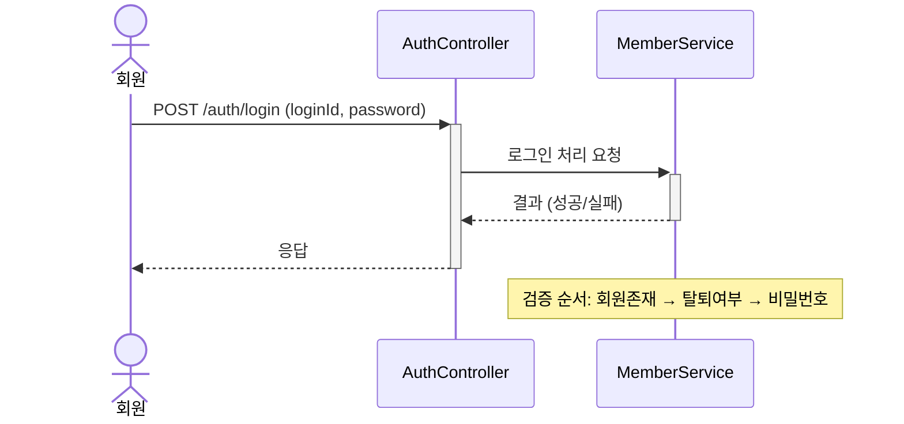
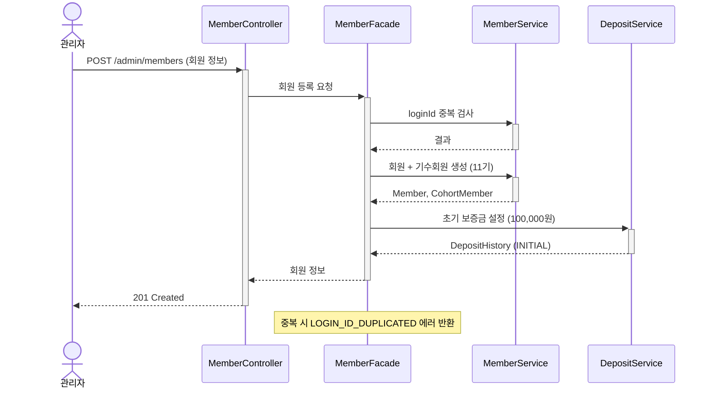
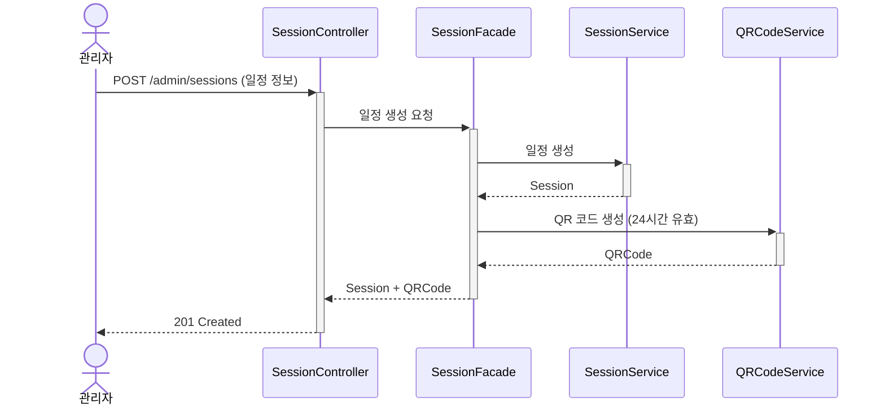
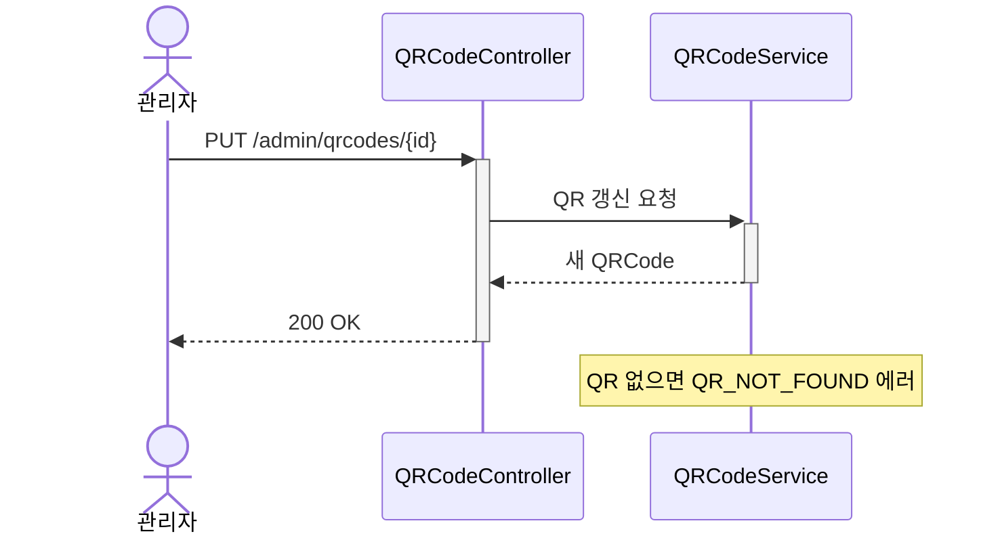
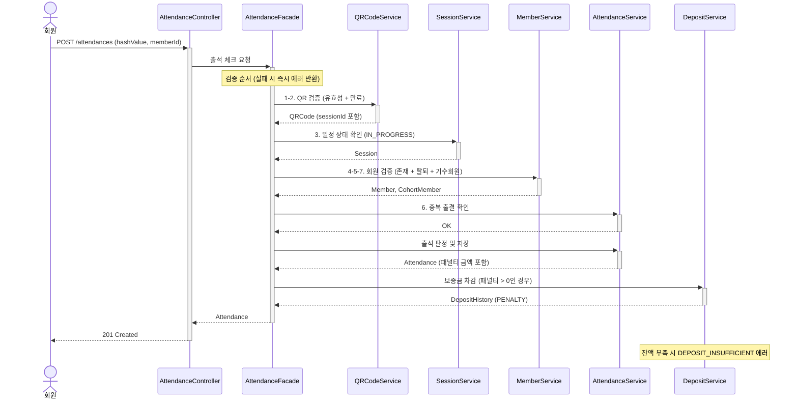
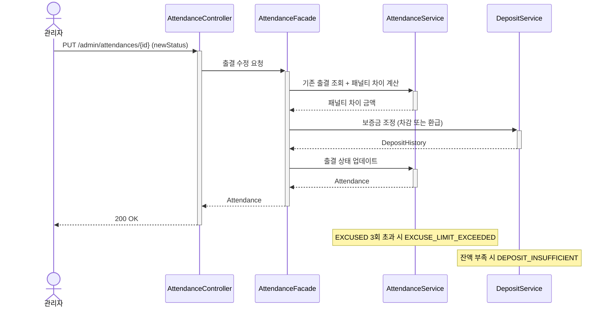

# 시퀀스 다이어그램

> 이 문서의 `*Service`는 Spring 레이어 기준의 Application Service를 의미한다.

## 1. 로그인

### 시퀀스 다이어그램

### 핵심 포인트
- MemberService가 회원 조회 + 상태 검증 + 비밀번호 검증 책임
- BCrypt 검증은 MemberService 내부에서 처리

### 설계 리스크
- 없음 (단순 조회 로직)

---

## 2. 회원 등록

### 시퀀스 다이어그램

### 핵심 포인트
- Facade가 MemberService와 DepositService를 조율
- 트랜잭션 경계는 각 Application Service에서 관리
- 실패 시 Facade에서 보상 로직 처리 가능

### 설계 리스크
- 크로스 도메인 트랜잭션: Member 생성 후 Deposit 실패 시 보상 필요

---

## 3. 일정 생성

### 시퀀스 다이어그램

### 핵심 포인트
- SessionService는 일정만, QRCodeService는 QR만 담당
- Facade가 두 Application Service를 조율

### 설계 리스크
- 없음 (단순 생성 로직)

---

## 4. QR 갱신

### 시퀀스 다이어그램

### 핵심 포인트
- 단일 도메인이므로 Facade 없이 Application Service 직접 호출
- 기존 QR 만료 + 새 QR 생성은 QRCodeService 트랜잭션 경계 내에서 처리

### 설계 리스크
- 없음 (단일 도메인 처리)

---

## 5. QR 출석 체크

### 시퀀스 다이어그램

### 핵심 포인트
- Facade가 5개 Application Service를 조율 (QR, Session, Member, Attendance, Deposit)
- 각 Application Service는 자기 도메인 검증만 담당
- 패널티 계산은 AttendanceService 내 PenaltyCalculator가 담당 (전략 패턴)
- 보증금 차감은 DepositService가 담당

### 설계 리스크
- 크로스 도메인 트랜잭션: Attendance 저장 후 Deposit 차감 실패 시 보상 필요
- 검증 순서가 비즈니스 요구사항이므로 순서 변경 시 영향 분석 필요

---

## 6. 출결 수정 (보증금 자동 조정)

### 시퀀스 다이어그램

### 핵심 포인트
- AttendanceService가 패널티 차이 계산 담당
- DepositService가 보증금 차감/환급 담당
- Facade가 두 Application Service를 조율하며 보상 로직 처리

### 설계 리스크
- 출결 상태 업데이트와 보증금 조정이 다른 트랜잭션일 경우 불일치 가능
- 공결 횟수 조정은 Facade에서 MemberService와 AttendanceService를 함께 조율하는 흐름으로 분리 검토 필요
