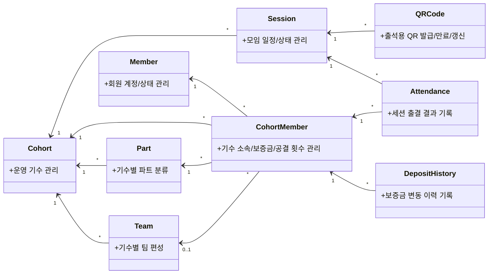
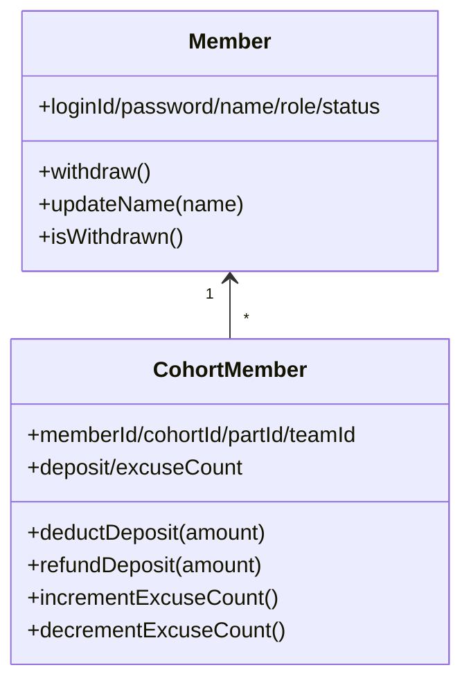
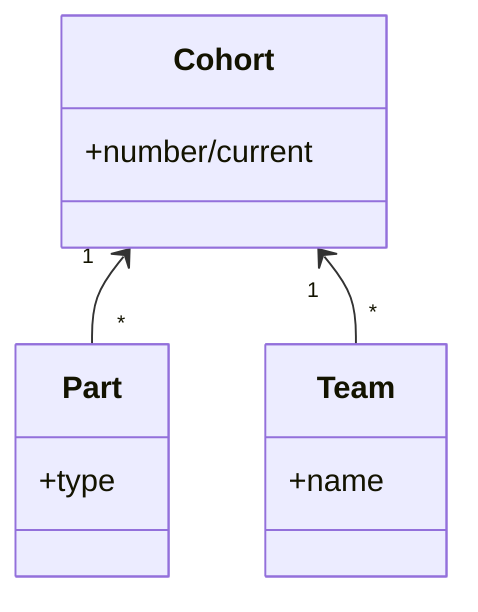
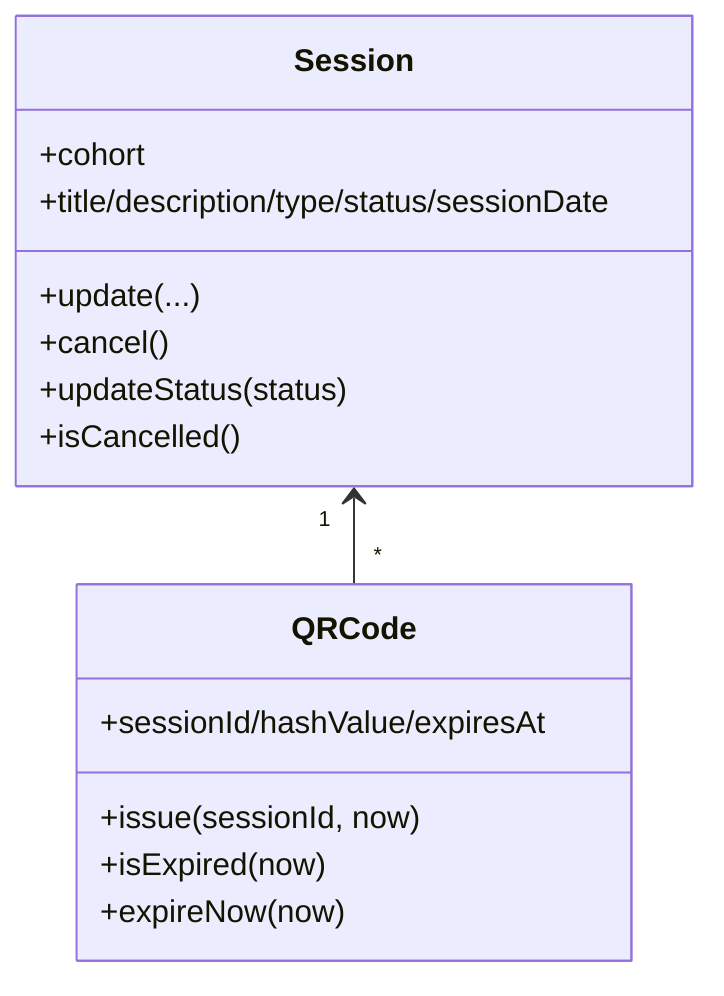
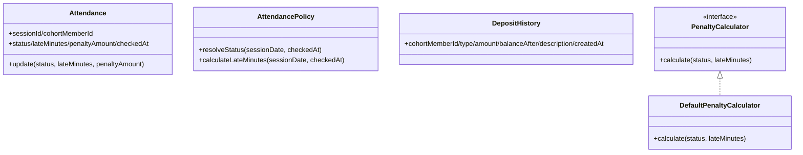

# 클래스 다이어그램

## 1. 도메인 맵(대표 관계)

---

## 2. 도메인별 책임

### 2.1 Member / CohortMember

### 2.2 Cohort / Part / Team

### 2.3 Session / QRCode

### 2.4 Attendance / Deposit

---

## 3. 문서 원칙

- 이 문서는 도메인 모델의 **관계와 책임**만 다룬다.
- `Controller`, `Facade`, `Repository` 같은 레이어 구성요소는 포함하지 않는다.
- 구현 상세(트랜잭션, SQL, 프레임워크 어노테이션 흐름)는 다른 설계 문서에서 다룬다.
