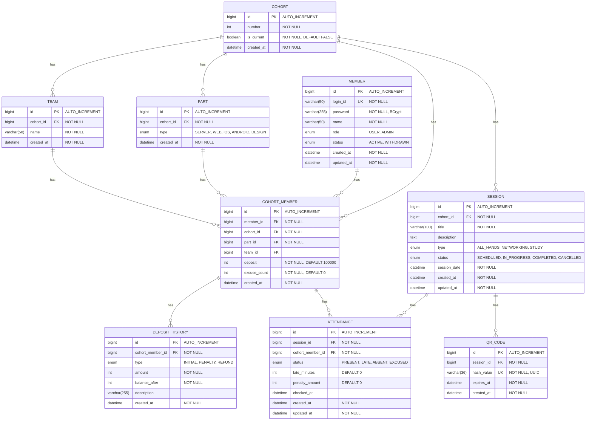

# ERD (Entity Relationship Diagram)

## 1. 전체 ERD



---

## 2. 테이블 상세 DDL

### 2.1 MEMBER

```sql
CREATE TABLE member (
    id BIGINT AUTO_INCREMENT PRIMARY KEY,
    login_id VARCHAR(50) NOT NULL UNIQUE,
    password VARCHAR(255) NOT NULL COMMENT 'BCrypt 암호화',
    name VARCHAR(50) NOT NULL,
    role ENUM('USER', 'ADMIN') NOT NULL DEFAULT 'USER',
    status ENUM('ACTIVE', 'WITHDRAWN') NOT NULL DEFAULT 'ACTIVE',
    created_at DATETIME NOT NULL DEFAULT CURRENT_TIMESTAMP,
    updated_at DATETIME NOT NULL DEFAULT CURRENT_TIMESTAMP ON UPDATE CURRENT_TIMESTAMP,

    INDEX idx_login_id (login_id),
    INDEX idx_status (status)
) ENGINE=InnoDB DEFAULT CHARSET=utf8mb4 COLLATE=utf8mb4_unicode_ci;
```

### 2.2 COHORT

```sql
CREATE TABLE cohort (
    id BIGINT AUTO_INCREMENT PRIMARY KEY,
    number INT NOT NULL,
    is_current BOOLEAN NOT NULL DEFAULT FALSE,
    created_at DATETIME NOT NULL DEFAULT CURRENT_TIMESTAMP,

    INDEX idx_is_current (is_current)
) ENGINE=InnoDB DEFAULT CHARSET=utf8mb4 COLLATE=utf8mb4_unicode_ci;
```

### 2.3 PART

```sql
CREATE TABLE part (
    id BIGINT AUTO_INCREMENT PRIMARY KEY,
    cohort_id BIGINT NOT NULL,
    type ENUM('SERVER', 'WEB', 'iOS', 'ANDROID', 'DESIGN') NOT NULL,
    created_at DATETIME NOT NULL DEFAULT CURRENT_TIMESTAMP,

    FOREIGN KEY (cohort_id) REFERENCES cohort(id),
    INDEX idx_cohort_id (cohort_id),
    UNIQUE KEY uk_cohort_type (cohort_id, type)
) ENGINE=InnoDB DEFAULT CHARSET=utf8mb4 COLLATE=utf8mb4_unicode_ci;
```

### 2.4 TEAM

```sql
CREATE TABLE team (
    id BIGINT AUTO_INCREMENT PRIMARY KEY,
    cohort_id BIGINT NOT NULL,
    name VARCHAR(50) NOT NULL,
    created_at DATETIME NOT NULL DEFAULT CURRENT_TIMESTAMP,

    FOREIGN KEY (cohort_id) REFERENCES cohort(id),
    INDEX idx_cohort_id (cohort_id),
    UNIQUE KEY uk_cohort_name (cohort_id, name)
) ENGINE=InnoDB DEFAULT CHARSET=utf8mb4 COLLATE=utf8mb4_unicode_ci;
```

### 2.5 COHORT_MEMBER

```sql
CREATE TABLE cohort_member (
    id BIGINT AUTO_INCREMENT PRIMARY KEY,
    member_id BIGINT NOT NULL,
    cohort_id BIGINT NOT NULL,
    part_id BIGINT NOT NULL,
    team_id BIGINT,
    deposit INT NOT NULL DEFAULT 100000,
    excuse_count INT NOT NULL DEFAULT 0,
    created_at DATETIME NOT NULL DEFAULT CURRENT_TIMESTAMP,

    FOREIGN KEY (member_id) REFERENCES member(id),
    FOREIGN KEY (cohort_id) REFERENCES cohort(id),
    FOREIGN KEY (part_id) REFERENCES part(id),
    FOREIGN KEY (team_id) REFERENCES team(id),
    INDEX idx_member_id (member_id),
    INDEX idx_cohort_id (cohort_id),
    UNIQUE KEY uk_member_cohort (member_id, cohort_id)
) ENGINE=InnoDB DEFAULT CHARSET=utf8mb4 COLLATE=utf8mb4_unicode_ci;
```

### 2.6 SESSION

```sql
CREATE TABLE session (
    id BIGINT AUTO_INCREMENT PRIMARY KEY,
    cohort_id BIGINT NOT NULL,
    title VARCHAR(100) NOT NULL,
    description TEXT,
    type ENUM('ALL_HANDS', 'NETWORKING', 'STUDY') NOT NULL,
    status ENUM('SCHEDULED', 'IN_PROGRESS', 'COMPLETED', 'CANCELLED') NOT NULL DEFAULT 'SCHEDULED',
    session_date DATETIME NOT NULL,
    created_at DATETIME NOT NULL DEFAULT CURRENT_TIMESTAMP,
    updated_at DATETIME NOT NULL DEFAULT CURRENT_TIMESTAMP ON UPDATE CURRENT_TIMESTAMP,

    FOREIGN KEY (cohort_id) REFERENCES cohort(id),
    INDEX idx_cohort_id (cohort_id),
    INDEX idx_status (status),
    INDEX idx_session_date (session_date)
) ENGINE=InnoDB DEFAULT CHARSET=utf8mb4 COLLATE=utf8mb4_unicode_ci;
```

### 2.7 QR_CODE

```sql
CREATE TABLE qr_code (
    id BIGINT AUTO_INCREMENT PRIMARY KEY,
    session_id BIGINT NOT NULL,
    hash_value VARCHAR(36) NOT NULL UNIQUE COMMENT 'UUID',
    expires_at DATETIME NOT NULL,
    created_at DATETIME NOT NULL DEFAULT CURRENT_TIMESTAMP,

    FOREIGN KEY (session_id) REFERENCES session(id),
    INDEX idx_session_id (session_id),
    INDEX idx_hash_value (hash_value),
    INDEX idx_expires_at (expires_at)
) ENGINE=InnoDB DEFAULT CHARSET=utf8mb4 COLLATE=utf8mb4_unicode_ci;
```

### 2.8 ATTENDANCE

```sql
CREATE TABLE attendance (
    id BIGINT AUTO_INCREMENT PRIMARY KEY,
    session_id BIGINT NOT NULL,
    cohort_member_id BIGINT NOT NULL,
    status ENUM('PRESENT', 'LATE', 'ABSENT', 'EXCUSED') NOT NULL,
    late_minutes INT DEFAULT 0,
    penalty_amount INT DEFAULT 0,
    checked_at DATETIME,
    created_at DATETIME NOT NULL DEFAULT CURRENT_TIMESTAMP,
    updated_at DATETIME NOT NULL DEFAULT CURRENT_TIMESTAMP ON UPDATE CURRENT_TIMESTAMP,

    FOREIGN KEY (session_id) REFERENCES session(id),
    FOREIGN KEY (cohort_member_id) REFERENCES cohort_member(id),
    INDEX idx_session_id (session_id),
    INDEX idx_cohort_member_id (cohort_member_id),
    UNIQUE KEY uk_session_cohort_member (session_id, cohort_member_id)
) ENGINE=InnoDB DEFAULT CHARSET=utf8mb4 COLLATE=utf8mb4_unicode_ci;
```

### 2.9 DEPOSIT_HISTORY

```sql
CREATE TABLE deposit_history (
    id BIGINT AUTO_INCREMENT PRIMARY KEY,
    cohort_member_id BIGINT NOT NULL,
    type ENUM('INITIAL', 'PENALTY', 'REFUND') NOT NULL,
    amount INT NOT NULL,
    balance_after INT NOT NULL,
    description VARCHAR(255),
    created_at DATETIME NOT NULL DEFAULT CURRENT_TIMESTAMP,

    FOREIGN KEY (cohort_member_id) REFERENCES cohort_member(id),
    INDEX idx_cohort_member_id (cohort_member_id),
    INDEX idx_created_at (created_at)
) ENGINE=InnoDB DEFAULT CHARSET=utf8mb4 COLLATE=utf8mb4_unicode_ci;
```

---

## 3. 시드 데이터

### 3.1 기수 (Cohort)

```sql
INSERT INTO cohort (number, is_current) VALUES
(10, FALSE),
(11, TRUE);
```

### 3.2 파트 (Part)

```sql
-- 10기 파트
INSERT INTO part (cohort_id, type) VALUES
(1, 'SERVER'),
(1, 'WEB'),
(1, 'iOS'),
(1, 'ANDROID'),
(1, 'DESIGN');

-- 11기 파트
INSERT INTO part (cohort_id, type) VALUES
(2, 'SERVER'),
(2, 'WEB'),
(2, 'iOS'),
(2, 'ANDROID'),
(2, 'DESIGN');
```

### 3.3 팀 (Team)

```sql
-- 11기 팀
INSERT INTO team (cohort_id, name) VALUES
(2, 'Team A'),
(2, 'Team B'),
(2, 'Team C');
```

### 3.4 관리자 (Admin)

```sql
-- password: admin1234 (BCrypt 해시)
INSERT INTO member (login_id, password, name, role, status) VALUES
('admin', '$2a$10$...BCrypt해시...', 'Admin', 'ADMIN', 'ACTIVE');

-- 관리자 기수 회원 정보 (11기)
INSERT INTO cohort_member (member_id, cohort_id, part_id, team_id, deposit, excuse_count) VALUES
(1, 2, 6, NULL, 100000, 0);

-- 관리자 초기 보증금 이력
INSERT INTO deposit_history (cohort_member_id, type, amount, balance_after, description) VALUES
(1, 'INITIAL', 100000, 100000, '초기 보증금');
```

---

## 4. 인덱스 전략

| 테이블 | 인덱스 | 목적 |
|--------|--------|------|
| member | idx_login_id | 로그인 시 loginId 조회 |
| member | idx_status | 활성 회원 필터링 |
| cohort | idx_is_current | 현재 기수 조회 |
| cohort_member | uk_member_cohort | 회원-기수 중복 방지 |
| session | idx_status | 상태별 일정 필터링 |
| session | idx_session_date | 날짜별 일정 조회 |
| qr_code | idx_hash_value | QR 해시값 조회 (출석 체크) |
| qr_code | idx_expires_at | 만료 QR 필터링 |
| attendance | uk_session_cohort_member | 중복 출결 방지 |
| deposit_history | idx_created_at | 이력 시간순 조회 |

---

## 5. 제약조건 요약

| 테이블 | 제약조건 | 설명 |
|--------|----------|------|
| member.login_id | UNIQUE | 시스템 전체 유니크 (탈퇴 회원 포함) |
| part | UK(cohort_id, type) | 기수당 파트 타입 유니크 |
| team | UK(cohort_id, name) | 기수당 팀 이름 유니크 |
| cohort_member | UK(member_id, cohort_id) | 회원은 기수당 1개 정보만 |
| attendance | UK(session_id, cohort_member_id) | 일정당 회원 1회 출결만 |
| qr_code.hash_value | UNIQUE | QR 해시값 유니크 |

---

## 6. H2 Database 호환성

H2 In-memory 데이터베이스 사용 시 고려사항:

```yaml
# application.yml
spring:
  datasource:
    url: jdbc:h2:mem:testdb;MODE=MySQL
    driver-class-name: org.h2.Driver
  h2:
    console:
      enabled: true
  jpa:
    hibernate:
      ddl-auto: create
    properties:
      hibernate:
        dialect: org.hibernate.dialect.H2Dialect
```

**MODE=MySQL 설정으로 MySQL 문법 호환 사용**
